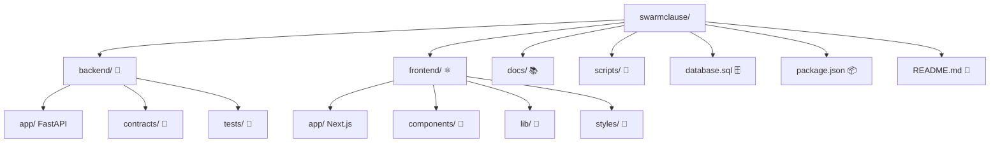

# 🧠✨ SWARMCLAUSE


**🤖 Autonomous AI Negotiation + 📊 Simulation + ⛓️ Settlement Infrastructure**

SWARMCLAUSE is a 🚀 **multi-agent contract negotiation system** where autonomous AI agents negotiate terms, simulate outcomes, and execute binding agreements instantly on Hedera.

---

## 🎯 Product Overview

### Tagline
**Autonomous Contracts Negotiated by AI, Settled by Hedera**

### One-Liner
SWARMCLAUSE enables AI agents to negotiate contracts in real-time, simulate outcomes for risk assessment, and execute binding agreements with smart contracts on the Hedera network.

### Core Value Proposition
- **🤖 AI-Powered Negotiation**: Autonomous agents negotiate terms using Groq LLM
- **📊 Risk Simulation**: Pre-settlement analysis to predict outcomes and recommend penalties
- **⛓️ Hedera Integration**: Smart contract escrow, HCS transcript logging, and HTS settlement
- **🖥️ Real-time Interface**: Modern web dashboard for monitoring negotiations and settlements

---

## 🏗️ Architecture

### 🛠️ Technology Stack

#### 🐍 Backend


- **FastAPI** (Python 3.11+) - ⚡ REST API server
- **SQLAlchemy** - 🗄️ Database ORM
- **Groq API** - 🧠 AI agent reasoning
- **Hedera SDK** - ⛓️ Blockchain integration
- **SQLite** - 💾 Local development database

#### ⚛️ Frontend


- **Next.js 16** - ⚛️ React framework
- **TypeScript** - 🔒 Type safety
- **Tailwind CSS** - 🎨 Styling
- **Radix UI** - 🧩 Component library
- **Supabase** - 🗄️ Database and auth

#### ⛓️ Blockchain

- **Hedera Smart Contracts** - 📜 Escrow and settlement
- **Hedera Consensus Service (HCS)** - 📝 Transcript logging
- **Hedera Token Service (HTS)** - 💰 Settlement payments

---

## 📁 Project Structure



```
📂 swarmclause/
├── 🐍 backend/                    # FastAPI Python backend
│   ├── app/
│   │   ├── main.py            # FastAPI application entry
│   │   ├── core/              # ⚙️ Configuration
│   │   ├── db/                # 🗄️ Database models
│   │   ├── models/            # 📋 Pydantic models
│   │   ├── schemas/           # 📄 API schemas
│   │   ├── services/          # 🔧 Business logic
│   │   └── api/               # 🌐 API endpoints
│   ├── contracts/             # 📜 Solidity smart contracts
│   ├── tests/                 # 🧪 Backend tests
│   └── requirements.txt       # 📦 Python dependencies
├── ⚛️ frontend/                   # Next.js React frontend
│   ├── app/                   # 📱 App router pages
│   ├── components/            # 🧩 React components
│   ├── lib/                   # 🔧 Utility functions
│   └── styles/                # 🎨 Global styles
├── 📚 docs/                      # 📖 Documentation
├── 📜 scripts/                   # 🚀 Deployment scripts
├── 🗄️ database.sql               # Supabase schema
├── 📦 package.json               # Root dependencies
└── 📖 README.md                  # This file
```

---

## 🛠️ Getting Started

### 📋 Prerequisites


- Node.js 18+
- Python 3.11+
- Hedera account with testnet tokens
- Groq API key
- Supabase account

### 1️⃣ Clone the Repository
```bash
git clone https://github.com/austinLorenzMccoy/swarmclause.git
cd swarmclause
```

### 2️⃣ Backend Setup 🐍

```bash
cd backend

# Create virtual environment
python -m venv .venv
source .venv/bin/activate  # On Windows: .venv\Scripts\activate

# Install dependencies
pip install -r requirements.txt

# Create environment file
cp .env.example .env
# Edit .env with your API keys and configuration

# Start the backend server
uvicorn app.main:app --reload --port 8001
```

### 3️⃣ Frontend Setup ⚛️

```bash
cd frontend

# Install dependencies
npm install

# Create environment file
cp .env.example .env
# Edit .env with your Supabase and API configuration

# Start the development server
npm run dev
```

### 4️⃣ Database Setup 🗄️

1. Create a new Supabase project
2. Run the `database.sql` script in the Supabase SQL editor
3. Configure environment variables with your Supabase URL and anon key

### 5️⃣ Hedera Setup ⛓️

1. Create a Hedera testnet account
2. Fund your account with testnet HBAR
3. Deploy the smart contracts using the provided scripts:
```bash
cd scripts
node deploy-contract.js
node create-topic.js
```

---

## 🔧 Environment Variables

### Backend (.env) 🐍
```env
# Database
DB_PATH=./data/swarmclause.db

# APIs
GROQ_API_KEY=your_groq_api_key

# Hedera Configuration
HEDERA_OPERATOR_ID=your_hedera_account_id
HEDERA_OPERATOR_KEY=your_hedera_private_key
HEDERA_TOPIC_ID=your_hcs_topic_id
HEDERA_CONTRACT_ID=your_smart_contract_id
```

### Frontend (.env.local) ⚛️
```env
# Supabase
NEXT_PUBLIC_SUPABASE_URL=your_supabase_url
NEXT_PUBLIC_SUPABASE_ANON_KEY=your_supabase_anon_key

# Backend API
NEXT_PUBLIC_API_URL=http://localhost:8001
```

---

## 📊 Database Schema

The application uses the following main tables:

### 🤝 Sessions
- Negotiation sessions between buyer and seller agents
- Tracks status, participants, and contract transaction hashes

### 💰 Offers
- Structured offers made during negotiations
- Includes price, delivery terms, and penalty clauses

### 📝 Transcripts
- Complete negotiation conversation logs
- Mirrored to Hedera Consensus Service for immutability

### 📈 Simulations
- Risk analysis and outcome predictions
- AI-generated recommendations for penalties and terms

---

## 🤖 AI Agent Integration

### 🧠 Groq-Powered Negotiation
- Agents use Groq LLM for intelligent negotiation strategies
- Context-aware counter-offers based on negotiation history
- Risk assessment and penalty recommendations

### 📊 Simulation Engine
- Pre-settlement outcome prediction
- Confidence scoring for different scenarios
- Automated penalty clause generation

---

## ⛓️ Hedera Integration

### 📜 Smart Contracts
- Escrow management for negotiated agreements
- Automated penalty enforcement
- Settlement execution upon completion

### 📋 Consensus Service (HCS)
- Immutable transcript logging
- Timestamp verification for all negotiations
- Audit trail for legal compliance

### 💰 Token Service (HTS)
- Automated settlement payments
- Penalty distribution
- Multi-currency support

---

## 🧪 Testing

### Backend Tests 🐍
```bash
cd backend
pytest --cov=app --cov-report=term-missing
```

### Frontend Tests ⚛️
```bash
cd frontend
npm run test
```

---

## 📚 API Documentation

### Backend Endpoints 🌐

#### 🤝 Sessions
- `POST /api/sessions` - Create new negotiation session
- `GET /api/sessions/{id}` - Get session details
- `GET /api/sessions` - List all sessions

#### 💰 Offers
- `POST /api/offers` - Submit new offer
- `GET /api/offers/{session_id}` - Get offers for session

#### 📈 Simulations
- `POST /api/simulations` - Run risk simulation
- `GET /api/simulations/{session_id}` - Get simulation results

### ❤️ Health Check
- `GET /healthz` - Backend health status

---

## 🚀 Deployment

### Backend Deployment 🐍
```bash
cd backend
uvicorn app.main:app --host 0.0.0.0 --port 8001
```

### Frontend Deployment ⚛️
```bash
cd frontend
npm run build
npm start
```

### Smart Contract Deployment ⛓️
Use the provided scripts in the `scripts/` directory to deploy contracts to Hedera testnet or mainnet.

---

## 🔮 Future Roadmap

### 🚀 Phase 2 Features
- [ ] 🔄 WebSocket real-time negotiation updates
- [ ] 👥 Multi-party negotiation support
- [ ] 🎭 Advanced AI agent personas
- [ ] 📱 Mobile application
- [ ] 💬 Integration with popular messaging platforms

### 🌟 Phase 3 Features
- [ ] 🔗 Cross-chain settlement support
- [ ] ⚖️ Legal framework integration
- [ ] 🏢 Enterprise negotiation templates
- [ ] 📊 Advanced analytics dashboard
- [ ] 🔌 API for third-party integrations

---

## 🤝 Contributing

1. 🍴 Fork the repository
2. 🌿 Create a feature branch (`git checkout -b feature/amazing-feature`)
3. 💾 Commit your changes (`git commit -m 'Add amazing feature'`)
4. 📤 Push to the branch (`git push origin feature/amazing-feature`)
5. 🔃 Open a Pull Request

---

## 📄 License

This project is licensed under the MIT License - see the [LICENSE](LICENSE) file for details.

---

## 🙏 Acknowledgments

- **⛓️ Hedera** - For providing the robust blockchain infrastructure
- **🧠 Groq** - For fast and reliable AI inference
- **🗄️ Supabase** - For the excellent backend-as-a-service platform
- **🚀 Vercel** - For hosting the frontend application

---

## 📞 Support

For support and questions:
- 🐛 Create an issue in this repository
- 💬 Join our Discord community
- 📧 Email us at support@swarmclause.dev

---

**🚀 Built with ❤️ for the future of autonomous contracts**
